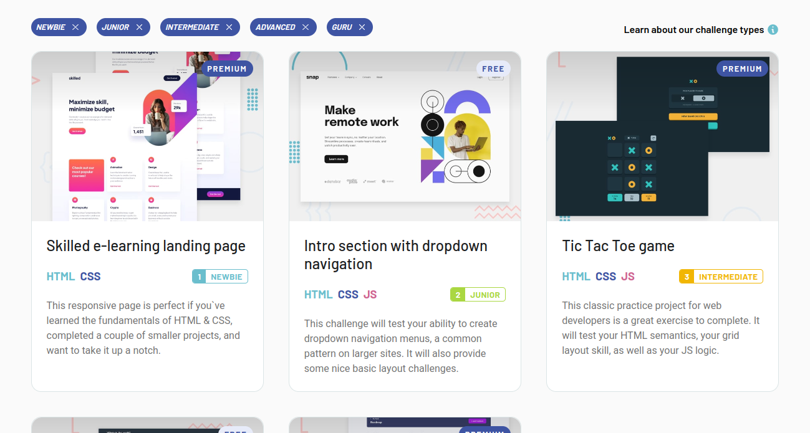

# frontend-mentor-challenges-reactjs
This is the challenge section of the [Frontend Mentor](https://www.frontendmentor.io/challenges) site, 
it is purely static with the only purpose of recreating its structure.

It was developed with ReactJS using [ViteJS](https://vitejs.dev/) for the generation of the files and structure of the project. 
I made use of functional components, props and SCSS for styling.

## Project preview


## How to run de project?
1. Clone the project on your own computer:
```Shell
$ git clone https://github.com/Remy349/frontend-mentor-challenges-reactjs.git

$ cd frontend-mentor-challenges-reactjs
```

2. Once inside the project run the following command in the terminal:
```Shell
$ npm install
```

3. Now, run the project:
```Shell
$ npm run dev
# You will probably see something like this
> frontend-mentor-challenges-reactjs@0.0.0 dev
> vite

  VITE v3.1.6  ready in 2132 ms

  ➜  Local:   http://localhost:5173/
  ➜  Network: use --host to expose
```

### Developed by Santiago de Jesús Moraga Caldera - Remy349(GitHub)

